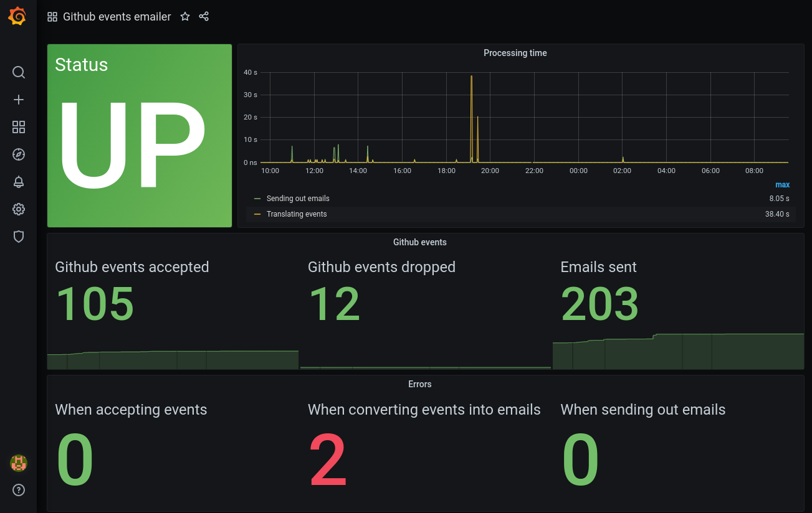

= GitHub events emailer

image:https://github.com/AlexanderZobkov/github-events-emailer/workflows/CI/badge.svg?branch=master["Build Status", link="https://github.com/AlexanderZobkov/github-events-emailer/actions?query=workflow%3ACI"]
image:https://img.shields.io/docker/v/zobkov/github-events-emailer?label=docker%20hub["Docker Image Version (latest by date)", link="https://hub.docker.com/r/zobkov/github-events-emailer/tags?page=1&ordering=last_updated"]
image:https://img.shields.io/maven-metadata/v?color=informational&label=Latest%20snapshot&metadataUrl=https%3A%2F%2Foss.jfrog.org%2Fartifactory%2Foss-snapshot-local%2Fcom%2Fgithub%2Falexander-zobkov%2Fgithub-events-emailer%2Fmaven-metadata.xml["Latest SNAPSHOT", link="https://oss.jfrog.org/artifactory/oss-snapshot-local/com/github/alexander-zobkov/github-events-emailer/"]

image:https://img.shields.io/github/license/AlexanderZobkov/github-events-emailer[GitHub]


== Build

```shell
./gradlew clean build
```

== Usage

=== Setting up a Webhook

https://developer.github.com/webhooks/creating/

The application supports webhooks that are setup in the following way:

* Payload URL
** It is set with plain HTTP with URL any path. Secured connection with SSL is not supported yet.
* Content type
** It is set to `application/json`. The `application/x-www-form-urlencoded` content type is not supported yet.
* Secret
** Could be left empty or set with any value. Payloads from github are not validated yet.
* Events
** On supported events, see section <<Supported events>>. However, the application will not crash if receive unexpected events.

=== Supported events

* https://developer.github.com/webhooks/event-payloads/#push[Pushes]
+
A single or multiple (as per number of commits in a push) emails will be sent that contains the following:
+
** Commit URL at Github
** Commit author and date
** Commit message
** Author and date
** Whole commit diff including a list of changed files

* https://developer.github.com/webhooks/event-payloads/#create[Branch or tag creation] (Only tag creation events are supported)
+
An email will be sent that contains the following:
+
** Tagger name
** Tag name

=== Configuration

link:src/main/resources/application.properties[See the configuration file for details].

=== Run

==== Standalone

Run the jar file as the following:

```shell
nohup java -jar github-events-emailer-<version>-boot.jar &
```

When you run in the standalone mode, the configuration files are loaded from the jar file.
To override configuration parameters, just place a copy of link:src/main/resources/application.properties[application.properties]
the file where Spring Boot link:https://docs.spring.io/spring-boot/docs/current/reference/html/spring-boot-features.html#boot-features-external-config-application-property-files[can find it].

==== Docker

Start a container instance as the following:

```shell
docker run -p 8080:8080 -e "github.oauthToken=<token>" -e "..." docker.io/zobkov/github-events-emailer
```

You can adjust the configuration of the instance by passing one or more environment variables on the `docker run` command line.
See the list of available variables in link:src/main/resources/application.properties[application.properties].

=== Monitoring

The application exposes link:https://docs.spring.io/spring-boot/docs/current/reference/html/production-ready-features.html#production-ready-endpoints[the Sprint Boot Actuator endpoints] over HTTP.
This includes registered additional metrics besides standard ones:

* CamelExchangesFailed - The metric allows to understand on which processing step and how many times exceptions/errors occurred
* CamelMessageHistory - The metric allows to get insight on how long it took to process this or that step

For example, the following URLs can show numbers on exceptions/errors occurred and how long it took while preparing emails based on recieved github events:

* http://localhost:8081/actuator/metrics/CamelExchangesFailed?tag=routeId:translator
* http://localhost:8081/actuator/metrics/CamelMessageHistory?tag=nodeId:translate-github-events

For example, the following URLs can show numbers on exceptions/errors occurred and how long it took while sending emails:

* http://localhost:8081/actuator/metrics/CamelExchangesFailed?tag=routeId:email-sender
* http://localhost:8081/actuator/metrics/CamelMessageHistory?tag=nodeId:send-email

An endpoint for link:https://prometheus.io/Prometheus[Prometheus] is also exposed, so you can use a Prometheus-Grafana stack to monitor the application.
To experiment with this, you can perform the following steps:

. Get a Prometheus-Grafana stacks: https://github.com/vegasbrianc/prometheus
. Add a `scrape_config` like link:https://docs.spring.io/spring-boot/docs/current/reference/html/production-ready-features.html#production-ready-metrics-export-prometheus[the one] shown in Spring Boot Actuator documentation to add to `prometheus.yml`
. Start the Prometheus-Grafana stack
. Import link:grafana-dashboard.json[a simple dashboard] that includes monitoring of the metrics listed above with the link:https://grafana.com/docs/grafana/latest/dashboards/export-import/#importing-a-dashboard[steps] described in Grafana documentation


